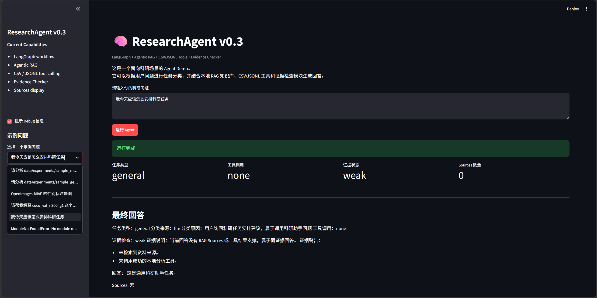

# ResearchAgent

ResearchAgent 是一个面向科研场景的 Agent Demo，基于 LangGraph 构建，支持 RAG、工具调用和证据检查。项目同时提供 CLI Demo 和 Streamlit Web UI，适合作为科研智能体、Agent 工作流和工程化应用的求职展示项目。

## 项目简介

本项目不是做一个“百科式万能助手”，而是围绕科研工作流提供可解释、可扩展的 Agent 能力：

- 通过 LangGraph 管理任务状态流转
- 根据问题类型做分类和路由
- 面向论文、实验、数据集等科研场景做 Agentic RAG
- 对实验 CSV / JSONL 文件做基础分析
- 使用 Evidence Checker 给出回答支撑情况
- 同时提供命令行和网页演示入口

## 当前版本

**ResearchAgent v0.4 Preview**

版本演进如下：

- v0.1：LangGraph 基础工作流
- v0.2：Agentic RAG
- v0.3：CSV / JSONL Tool Calling + Evidence Checker
- v0.4 Preview：Streamlit Web UI

## 核心功能

| 模块 | 功能 |
|---|---|
| LangGraph Workflow | 管理 Agent 状态流转和条件路由 |
| Task Classification | 将用户问题分为 paper / experiment / dataset / code / report / general |
| Agentic RAG | 根据 task_type 检索不同类型资料 |
| Chroma Vector Store | 本地向量库 |
| CSV Analyzer | 分析实验指标 CSV |
| JSONL Analyzer | 分析逐样本实验输出 JSONL |
| Evidence Checker | 判断回答是否有 Sources 或工具结果支撑 |
| Streamlit UI | Web 页面演示 |

## 项目结构

以下是当前仓库的核心结构，均为真实存在的目录和文件：

```text
ResearchAgent
├── app.py
├── run_cli.py
├── README.md
├── requirements.txt
├── src/
│   └── research_agent/
│       ├── eval/
│       ├── graph/
│       ├── rag/
│       ├── tools/
│       └── utils/
├── scripts/
├── data/
│   ├── papers/
│   ├── experiments/
│   ├── datasets/
│   └── samples/
├── docs/
├── examples/
├── notebooks/
├── tests/
└── storage/
```

### 重点目录说明

| 路径 | 说明 |
|---|---|
| app.py | Streamlit Web Demo 入口 |
| run_cli.py | CLI 运行入口 |
| src/research_agent/graph | LangGraph 工作流、节点、路由、证据检查 |
| src/research_agent/rag | 文档加载、索引、检索、向量库相关逻辑 |
| src/research_agent/tools | CSV / JSONL / 论文 / 数据集等工具 |
| scripts | 构建索引、测试、导出日志等脚本 |
| data | 科研文档、实验说明、样例数据 |

## 安装方式

建议使用 Python 3.11 和本地 Conda 环境。

### 新建环境

```powershell
cd F:\ResearchAgent
conda create --prefix .\.conda python=3.11 -y
```

### 安装依赖

如果是新环境或重新安装依赖：

```powershell
.\.conda\python.exe -m pip install -r requirements.txt
```

如果已有环境，只需重复执行同一条安装命令即可：

```powershell
.\.conda\python.exe -m pip install -r requirements.txt
```

## 环境变量

建议使用 `.env` 管理本地配置，不要把真实密钥写入 GitHub。

`.env.example` 的作用是作为环境变量模板，告诉使用者需要准备哪些配置项，例如：

- LLM 开关
- API Key
- Base URL
- 模型名称

说明：

- 不要上传真实 `.env`
- 如果仓库中还没有 `.env.example`，建议补充一个示例模板，便于他人快速上手

## 构建 RAG 索引

首次运行或更新 data 目录后，需要先构建本地向量索引：

```powershell
cd F:\ResearchAgent
.\.conda\python.exe scripts\build_index.py
```

索引会生成到本地 `storage/chroma_db`，该目录仅用于本地运行，不建议上传 GitHub。

## CLI 运行

运行命令：

```powershell
cd F:\ResearchAgent
.\.conda\python.exe run_cli.py
```

示例问题：

```text
- 请分析 data/experiments/sample_metrics.csv
- 请分析 data/experiments/sample_generations.jsonl
- OpenImages-MIAP 的性别标注是图像级还是 bbox 级？
- 请帮我解释 coco_val_n300_g1 这个实验的目的
- 我今天应该怎么安排科研任务
```

CLI 示例输出：

```text
ResearchAgent CLI Demo
请输入问题，输入 exit 退出。

User: 请分析 data/experiments/sample_metrics.csv

Answer:
已调用 CSV Analyzer 分析 data/experiments/sample_metrics.csv。
该文件包含实验指标表，可查看行数、列名、数值列摘要、低基数字段分布和样例行预览。

Evidence:
- 工具调用：CSV Analyzer
- 输入文件：data/experiments/sample_metrics.csv
```

## Streamlit Web Demo

推荐启动方式：

```powershell
cd F:\ResearchAgent
.\.conda\python.exe -m streamlit run app.py
```

项目已通过 `.streamlit/config.toml` 设置默认端口和稳定运行选项：

```toml
[server]
port = 8503
fileWatcherType = "none"
```

如果需要显式指定端口，也可以使用：

```powershell
cd F:\ResearchAgent
.\.conda\python.exe -m streamlit run app.py --server.port 8503
```

稳定启动方式也可以直接在命令行关闭 file watcher：

```powershell
cd F:\ResearchAgent
.\.conda\python.exe -m streamlit run app.py --server.port 8503 --server.fileWatcherType none
```

启动后，浏览器会打开 Local URL，默认是 `http://localhost:8503`。

说明：当前项目不依赖 `torchvision`。如果 Streamlit 默认 watcher 扫描到 `transformers` 的可选视觉模块并触发 `torchvision` 相关报错，不建议为了 watcher 报错额外安装 `torchvision`；关闭 file watcher 更轻量，也更适合这个 Demo 的稳定运行。

如果重新构建 Chroma 索引时遇到 `storage/chroma_db` 文件被占用，例如 Windows 上的 `WinError 32`，可以先关闭 Streamlit 页面，或运行：

```powershell
.\scripts\stop_streamlit.ps1
```

然后重新构建索引：

```powershell
.\.conda\python.exe scripts\build_index.py
```



## 示例能力展示

### 1. JSONL 文件分析

输入 `data/experiments/sample_generations.jsonl` 这类文件后，工具会返回：

- 记录数
- 字段列表
- 字段类型统计
- 布尔字段分布
- 列表字段长度统计
- 低基数字段 value_counts
- 前几条记录预览

### 2. CSV 指标分析

输入 `data/experiments/sample_metrics.csv` 后，CSV Analyzer 会展示：

- 行数和列数
- 列名
- 数值列摘要
- 低基数字段分布
- 样例行预览

### 3. 数据集资料 RAG 检索

当问题涉及数据集说明时，Agent 会检索 `data/datasets/` 中的 Markdown 文档，并回答：

- 数据集适合什么任务
- 标注粒度是什么
- 使用时有哪些限制
- 在本项目中的用途是什么

### 4. 实验证据 Sources

实验类问题会从 `data/experiments/` 检索对应实验说明，并在回答里展示 Sources，例如：

- 文件路径
- source_type
- title
- dataset
- run_tag

这有助于追溯回答依据，也方便调试检索是否命中正确资料。

### 5. Evidence Checker

Evidence Checker 会检查当前回答是否具备支撑依据，例如：

- 是否存在 Sources
- 是否调用了本地工具
- 是否有明显缺失的证据环节

它目前是规则版，适合做最小可用的可信度检查和调试提示。

## 当前限制

需要诚实说明的是，这仍然是一个 demo，而不是完整科研助手：

- 当前只是 demo，不是完整科研助手
- RAG 使用的是 sample documents 和项目内 Markdown 说明
- 工具分析只支持 CSV / JSONL 的基础统计
- Evidence Checker 是规则版，不是高级事实核查
- Web UI 是最小展示版，重点在功能跑通而不是复杂交互设计

## 后续计划

下一步可以继续增强以下能力：

- 更复杂实验指标分析
- 更强 Evidence Checker
- Report Writer
- 多 Agent 协作
- 更完善的 UI
- 支持更多文件类型

## 安全说明

请不要上传以下内容到 GitHub：

- `.env`
- `.conda/`
- `storage/`
- 大模型文件
- 原始大数据集

如果项目后续引入更多本地缓存、模型权重或中间产物，也建议继续写入 `.gitignore`。

## 运行建议

通常建议按下面顺序执行：

1. 安装依赖
2. 构建 RAG 索引
3. 运行 CLI 或 Streamlit Demo

这样可以更快确认是依赖问题、索引问题，还是 UI 问题。

## Optional LLM-assisted Report Writer

ResearchAgent 支持可选的 LLM 辅助报告生成能力。

默认情况下，该功能关闭，项目会使用模板版 Report Writer。

如需启用，请在 `.env` 中设置：

```env
ENABLE_LLM_REPORT_WRITER=true
OPENAI_API_KEY=your_api_key_here
OPENAI_MODEL=gpt-4o-mini

## 项目亮点

- **LangGraph 多节点工作流**：使用显式状态管理和条件路由组织 Agent 流程。
- **Agentic RAG**：根据任务类型选择不同资料库检索范围，而不是全库混合检索。
- **实验工具调用**：支持 CSV 和 JSONL 实验文件分析，适合科研实验结果解释场景。
- **Evidence Checker**：在最终回答前检查是否存在 Sources 或工具结果支撑。
- **Streamlit Web Demo**：提供可视化界面，展示任务类型、工具调用、证据状态和 Debug State。
- **工程化结构**：采用 `src/`、`scripts/`、`data/`、`docs/` 等目录组织，便于扩展和展示。